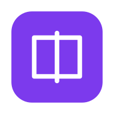

<div align="center">
  <picture>
    <source media="(prefers-color-scheme: dark)" srcset="public/icons/icon-512.png">
    
  </picture>
  <h1 style="margin-top: 12px;">LinkVault</h1>
  <p><strong>Your Personal Knowledge Hub</strong></p>
  <p>
    <a href="#-features">Features</a> •
    <a href="#-creative-use-cases">Use Cases</a> •
    <a href="#-quick-start">Quick Start</a> •
    <a href="#-install-on-your-phone">Mobile</a> •
    <a href="#-export--backup">Export</a> •
    <a href="#-folder-sync-to-computer">Sync</a> •
    <a href="#-faq">FAQ</a>
  </p>
  <br>
  <p>
    
    
    
    
    
    
    <br>
    
    
    
    
  </p>
  <br>
  <a href="https://vercel.com/new" target="_blank">
    
  </a>
  <br><br>
</div>

---

## The Problem

You have 50+ browser tabs open. Bookmarks scattered across Chrome, Firefox, and Edge. Notes in Notion, Google Keep, and Apple Notes. Screenshots on your desktop. PDFs in Downloads. A Notion board you haven't touched in months.

**You're not organized — you're fragmented.**

Every tool wants you to sign up. Pay monthly. Trust their servers. Lock your data in their format.

## The Solution

LinkVault is the one place for everything — links, notes, files, folders — that lives entirely in your browser. No account. No server. No subscription. No one else touches your data.

---

## 🧠 Why LinkVault?

### 100% Client-Side. Zero Servers.

Your data never leaves your device. It's stored in your browser's IndexedDB — the same database technology that powers Google Docs offline, Notion's offline mode, and countless other apps. There is no backend, no cloud, no API. No one can access your data except you.

### Works Everywhere

Install it like a native app on any device:
- **Android** — Open in Chrome → "Add to Home Screen"
- **iPhone/iPad** — Open in Safari → Share → "Add to Home Screen"
- **Laptop** — Chrome/Edge/Brave → Install icon in address bar

Opens full-screen with no browser address bar. Works offline.

### You Own Your Data

Three layers of data ownership:
1. **IndexedDB** — instantly available in the browser
2. **Folder Sync** — write everything as real files to any folder on your computer (OneDrive, Google Drive, Dropbox, USB drive, NAS)
3. **Export** — download as Excel or Full ZIP with attachments whenever you want

### No Learning Curve

If you know how to use a file explorer and a bookmark manager, you already know how to use LinkVault. Folders work like folders. Links work like bookmarks. Files work like drag-and-drop.

---

## ✨ Features

### Core

| Feature | What it does |
|---------|-------------|
| **Save Links** | Title, URL, description, notes — everything you need to remember why you saved it |
| **Nested Folders** | Unlimited depth, parent-child, drag to reorder, move, duplicate |
| **File Attachments** | Images, PDFs, documents, audio, video — up to 50MB per file |
| **Paste Screenshots** | Take a screenshot, press Ctrl+V — it's attached instantly |
| **Tags** | Add unlimited tags, color-coded, filterable, searchable |
| **Custom Fields** | Key-value pairs for anything — price, deadline, status, rating, contact info |
| **Favorites** | Star your most important links for one-click access |
| **Archive** | Move done/completed items out of the way without deleting |

### Power User

| Feature | What it does |
|---------|-------------|
| **Tab Multitasking** | Open multiple pages as tabs — Dashboard, Folders, All Links, any folder. Closable tabs persist across sessions |
| **Bulk Actions** | Select any number of links — export, move, delete in one click |
| **Search** | Global search across links, folders, tags, descriptions, and notes |
| **Drag to Reorder** | Drag folders and links to rearrange — order is preserved everywhere |
| **Form Field Settings** | Toggle visibility of form sections — hide fields you never use |
| **Duplicate** | One-click duplicate for folders (with all contents) and links (with all attachments) |

### Export & Backup

| Feature | What it does |
|---------|-------------|
| **Excel Export** | Clean .xlsx file with title, URL, tags, folder, custom fields. Opens in Excel, Google Sheets, Numbers, LibreOffice |
| **Full ZIP Export** | Excel metadata + all attachment files organized in per-link subfolders |
| **Auto Folder Sync** | Every change automatically writes real files to your chosen computer folder |

### Folder Sync

| Feature | What it does |
|---------|-------------|
| **Real Files** | Not a proprietary format — real directories, .xlsx files, and attachment files |
| **One-Time Setup** | Click "Sync Off" → pick a folder → done. Forever. |
| **Instant Sync** | Every add, edit, delete, move, duplicate triggers auto-sync immediately |
| **Readable Anywhere** | Open the .xlsx files in any spreadsheet app. Open attachments directly. |
| **Portable** | Plug in a USB drive with the synced folder — access everything on any computer |

**Sync folder structure:**
```
📁 LinkVault/
├── 📁 FolderName/
│   ├── 📄 metadata.xlsx               (folder name, description, dates)
│   └── 📁 links/
│       ├── 📁 Link Title/
│       │   ├── 📄 data.xlsx            (title, URL, notes, tags, custom fields)
│       │   ├── 📄 screenshot.png       (original file)
│       │   └── 📄 resume.pdf          (original file)
│       └── 📁 Another Link/
│           └── ...
├── 📁 Uncategorized/
│   └── ...
└── ...
```

---

## 💡 Creative Use Cases

### 1. Job Search Tracker

Track every job application from discovery to offer.

```
📁 Job Search 2026/
├── 📁 Applied/
│   ├── 🔗 Senior Frontend Engineer at Google
│   │   ├── 📄 resume-google.pdf
│   │   ├── 📄 cover-letter.pdf
│   │   ├── 🏷️ google, frontend, remote
│   │   └── 📋 Custom: Recruiter: jane@google.com | Salary: 180K-220K
│   └── 🔗 UX Designer at Airbnb
├── 📁 Phone Screen/
├── 📁 Interview/
├── 📁 Offer/
│   └── 🔗 Full Stack at Stripe
│       └── 📋 Custom: Offer: 250K + equity | Decision deadline: Apr 15
└── 📁 Rejected/
```

Add links to job postings, attach tailored resumes and cover letters, tag by company and role, use custom fields for recruiter contact and salary range. Drag links between folders as you advance.

**Why this beats a spreadsheet**: Attachments embedded, tags for filtering, no manual columns, portable to any device.

---

### 2. Recipe Collection

Build a searchable digital cookbook with photos and notes.

**📁 Recipes/**
- **📁 Breakfast** → Pancakes, Avocado Toast, Smoothie Bowls
- **📁 Dinner** → Butter Chicken, Lasagna, Stir Fry
- **📁 Desserts** → Tiramisu, Cheesecake, Brownies
- **📁 Snacks** → Hummus, Energy Balls, Guacamole

Each recipe has: the original URL, a screenshot of the recipe card, a photo of your own cooked version, tags (vegetarian, quick, spicy, keto), and notes on substitutions you made.

### Why this beats Pinterest**: Attach your own photos, add custom ratings, keep private notes.

---

### 3. DIY Project Dashboard

Manage home improvement, electronics, and 3D printing projects.

**📁 Projects/**
- **📁 Bookshelf Build** → 🔗 Woodworking 101 guide, 📄 schematics.pdf, 📄 parts-list.xlsx, 📄 progress-photo-1.jpg, 📋 Budget: $150 | Status: In Progress
- **📁 Drone Build** → 🔗 YouTube tutorial, PDF flight controller manual, component photos
- **📁 Garden Shed** → 🔗 permit application link, 📄 blueprint.pdf, 📋 Budget: $3000 | Deadline: June 1

DIY projects involve scattered research, multiple PDFs, progress tracking, and budget management — all in one place.

---

### 4. Travel Planning Hub

Plan every trip from dream to departure.

**📁 Travel 2026/**
- **📁 Japan** → 🔗 Flight booking, 🔗 5 hostels, 🔗 JR Pass info, 📄 booking-confirmation.pdf, 📄 itinerary.pdf, 📋 Trip Ref: JPN-001 | Cost: $3200
- **📁 Vietnam** → 🔗 Visa info, 🔗 Halong Bay cruise, 📄 e-visa.pdf
- **📁 Thailand** → 🔗 Muay Thai classes, 🔗 island hopping

Attach booking confirmations, visa documents, insurance PDFs, screenshots of must-try restaurants. Custom fields for booking reference numbers, costs, and dates.

### 5. Learning & Courses

Track your self-education journey.

**📁 Learning/**
- **📁 Python** → 🔗 Coursera course, 📄 notes.md, 📄 certificate.pdf, 📋 Platform: Coursera | Hours: 40 | Completed: Yes
- **📁 React** → 🔗 YouTube playlist, 📄 project-screenshot.jpg, 📋 Hours: 15 | In Progress
- **📁 Data Science** → 🔗 Kaggle competition, 📄 dataset.csv, 📄 analysis-notebook.pdf

Save course links, upload your notes and homework, attach screenshots of completed projects, tag by platform and skill level, track completion via custom fields.

### 6. Shopping & Price Research

Make informed purchase decisions.

**📁 Wishlist/**
- **📁 Laptops** → 🔗 MacBook Pro, 🔗 Dell XPS, 🔗 ThinkPad — each with price, store, rating
- **📁 Home Office** → 🔗 Standing Desk, 🔗 Monitor, 🔗 Chair — with spec sheets
- **📁 Gear** → 🔗 Camera, 🔗 Backpack — with comparison notes

Custom fields for store, current price, target price, rating, and delivery date. Tags: "top-pick", "budget", "waiting-for-sale". Archive after purchase.

---

## 🚀 Quick Start

```
Step 1: Open the app on any device
Step 2: Click "+" or "Add Link" to save your first link
Step 3: Create folders from the sidebar to organize
Step 4: Attach files — upload or Ctrl+V paste screenshots
Step 5: Click "Sync Off" → pick a folder on your computer
Step 6: Your entire vault is now synced as real files
```

Time to start: **30 seconds**. No account needed.

---

## 📱 Install on Your Phone

**Android (Chrome):**
1. Open your LinkVault URL
2. Tap the three-dot menu (⋮)
3. Tap "Add to Home Screen"
4. Tap "Add" — it appears on your home screen like any app

**iPhone/iPad (Safari):**
1. Open your LinkVault URL
2. Tap the Share button (📤)
3. Scroll down → "Add to Home Screen"
4. Tap "Add" in the top right

**Laptop (Chrome/Edge/Brave):**
1. Look for the install icon in the address bar (⊕ or 🖥️)
2. Click "Install"
3. Opens in its own window, no browser toolbar

---

## 💻 For Developers

### Tech Stack

| Layer | Technology |
|-------|-----------|
| **Frontend** | React 19 + TypeScript |
| **Build Tool** | Vite 8 — instant dev server, optimized bundles |
| **Styling** | Tailwind CSS v4 — utility-first, responsive, themeable |
| **Database** | Dexie.js — wraps IndexedDB with a simple async API |
| **State Management** | Zustand — minimal, fast, with localStorage persistence |
| **Excel Generation** | xlsx — creates proper .xlsx files compatible with Excel, Google Sheets, Numbers |
| **ZIP Generation** | JSZip — bundles attachments + Excel into downloadable ZIPs |
| **File System Sync** | File System Access API (Chromium only) — writes real files to disk |
| **PWA** | vite-plugin-pwa — service worker + manifest for installable app |
| **Icons** | Lucide React — clean, consistent, tree-shakeable |

### Prerequisites

- Node.js 18+
- npm

### Local Development

```bash
# Clone
git clone https://github.com/your-username/linkvault.git
cd linkvault

# Install
npm install

# Start dev server
npm run dev
```

Open http://localhost:5173 — hot reload included.

### Build for Production

```bash
npm run build
```

Output goes to `dist/` — ready to deploy.

### Preview Production Build

```bash
npm run preview
```

### Deploy to Vercel (Free, 1 Click)

[](https://vercel.com/new)

1. Push to GitHub
2. Click the button above or go to https://vercel.com/new
3. Import your repo
4. Click Deploy

**Auto-deploys**: Every push to main triggers a new deployment. Takes ~20 seconds.

### Deploy Anywhere Else

The `dist/` folder works on any static host:
- Netlify → `npm run build` + drag `dist/` folder
- Cloudflare Pages → connect GitHub repo
- GitHub Pages → push `dist/` to `gh-pages` branch
- Any web server → copy `dist/` contents to your server

### Project Structure

```
📁 linkvault/
├── 📄 index.html                  # Entry HTML with PWA meta tags
├── 📄 vite.config.ts              # Vite config + PWA plugin
├── 📄 vercel.json                 # Vercel deploy config
├── 📄 package.json                # Dependencies and scripts
├── 📁 public/
│   ├── 📁 icons/                  # PWA icons (192×192, 512×512)
│   ├── 📄 favicon.svg             # Browser tab icon
│   ├── 📄 manifest.json           # PWA manifest
│   └── 📄 sw.js                   # Service worker (offline cache)
├── 📁 src/
│   ├── 📄 main.tsx                # App entry point
│   ├── 📄 App.tsx                 # Router setup
│   ├── 📁 components/
│   │   ├── 📁 features/           # QuickActions, FolderPicker, ImportExport, StatsCard, DriveSyncSetup
│   │   ├── 📁 folders/           # FolderTree, FolderForm
│   │   ├── 📁 layout/            # Layout, Sidebar, Header, TabBar
│   │   ├── 📁 links/              # LinkForm, LinkListItem, LinkDetailModal, FileAttachment, FileDropZone, BulkActions, CustomFieldsSection
│   │   └── 📁 ui/                # Button, Input, TextArea, Select, Badge, Modal, EmptyState, Dropdown, ConfirmDialog, SearchBar
│   ├── 📁 core/
│   │   ├── 📄 database.ts          # Dexie DB with version 2 schema (folders, links, attachments)
│   │   ├── 📄 types.ts           # All interfaces: Folder, Link, Attachment, CustomField, etc.
│   │   ├── 📄 utils.ts           # Utilities: ID gen, date format, URL validation, tag colors, file buffer helpers
│   │   ├── 📄 export.ts            # Excel (.xlsx) + ZIP export logic
│   │   └── 📄 fileSync.ts        # File System Access API — picks folder, writes real files
│   ├── 📁 pages/
│   │   ├── 📄 Dashboard.tsx      # Stats cards, recently added/opened, quick actions
│   │   ├── 📄 AllLinks.tsx       # All links view with search, sort, filters
│   │   ├── 📄 Favorites.tsx     # Starred links
│   │   ├── 📄 Archive.tsx       # Archived links
│   │   ├── 📄 Folders.tsx       # Folder overview grid
│   │   ├── 📄 FolderDetail.tsx  # Single folder view with breadcrumbs
│   │   └── 📄 GettingStarted.tsx # Guide with examples
│   └── 📁 store/
│       ├── 📄 useStore.ts        # Folders CRUD, Links CRUD, dashboard stats, search — all with autoSync
│       ├── 📄 useSyncStore.ts    # Sync state (enabled, status, lastSyncedAt, rootHandle)
│       ├── 📄 useTabStore.ts     # Open tabs, active tab — persisted to localStorage
│       ├── 📄 useFieldSettings.ts # Form field visibility — persisted to localStorage
│       └── 📄 useSelection.ts   # Bulk selection (Set<string>)
```

---

## 🌐 Browser Compatibility

| Browser | Core App | Folder Sync | PWA Install |
|---------|---------|-------------|-------------|
| **Chrome** | ✅ | ✅ | ✅ |
| **Edge** | ✅ | ✅ | ✅ |
| **Brave** | ✅ | ✅ | ✅ |
| **Opera** | ✅ | ✅ | ✅ |
| **Firefox** | ✅ | ❌ | ✅ |
| **Safari (macOS)** | ✅ | ❌ | ✅ |
| **Safari (iOS)** | ✅ | ❌ | ✅ |
| **Chrome (Android)** | ✅ | ❌ | ✅ |

> **Note:** Folder Sync uses the File System Access API, currently limited to Chromium-based browsers. Firefox and Safari can use the full app — just without disk sync.

---

## ❓ FAQ

### General

**Is LinkVault free?**
Yes. Fully free, open source, no premium tiers, no ads, no tracking.

**Do I need an account?**
No. Nothing. No sign-up, no email, no password.

**Where is my data stored?**
In your browser's IndexedDB. It never leaves your device unless you choose to sync or export.

**Can I lose my data?**
Enable Folder Sync or export regularly. The sync writes real files to your computer — you can open them with any spreadsheet app.

### Data & Privacy

**Do you collect my data?**
No. There is no server. No analytics. No tracking. No cookies. The app runs entirely in your browser.

**Can I see my data outside LinkVault?**
With Folder Sync enabled, every link, folder, and attachment is a real file you can open in any app. The .xlsx files open in Excel, Google Sheets, Apple Numbers.

### Technical

**Can I import my browser bookmarks?**
Currently you can add links manually or paste them. Bulk import is on the roadmap.

**Can I use it offline?**
Yes. The PWA caches the app shell. IndexedDB works offline. All features work without internet.

**Can multiple people share a vault?**
LinkVault is designed for single-user. Data is local to each browser. For shared use, sync a folder to a shared cloud drive (OneDrive, Google Drive, Dropbox) and others can read the .xlsx files.

**Does it work on a tablet?**
Yes. Responsive design adapts to any screen size. Install via "Add to Home Screen" for tablet use.

### Sync & Backup

**What happens if I clear my browsing history or cookies?**
Your IndexedDB data may be cleared depending on your browser's settings. Always use Folder Sync or regular exports as backup.

**Can I sync to multiple folders?**
Not currently. Pick one folder — it's a complete mirror of your vault.

**Can I sync to cloud storage (OneDrive, Google Drive, Dropbox)?**
Yes. When picking a folder, choose one inside your cloud storage directory. The files sync to the cloud automatically.

**What format are the synced files?**
- Folder metadata: `.xlsx` files (openable in any spreadsheet app)
- Link data: `.xlsx` files with title, URL, notes, tags, custom fields
- Attachments: original file format (`.pdf`, `.jpg`, `.png`, etc.)

### Development

**Can I contribute?**
Yes. Fork, make changes, submit a PR. The project is MIT licensed.

**How do I customize or extend it?**
The codebase is clean TypeScript with clear separation between components, stores, and core logic. Add new features by creating components and hooks following existing patterns.

---

## 📄 License

MIT License — free to use, modify, and distribute.

See [LICENSE](LICENSE) for details.

---

## 💬 Support & Feedback

- Open an issue on GitHub
- Submit a pull request
- Fork and build your own version

---

<div align="center">
  <br>
  <p>
    <strong>No ads. No tracking. No servers. Just your data, your way.</strong>
  </p>
  <br>
  <a href="https://vercel.com/new" target="_blank">
    
  </a>
  <br><br>
  <sub>Built with React, Dexie.js, and ❤️</sub>
</div>